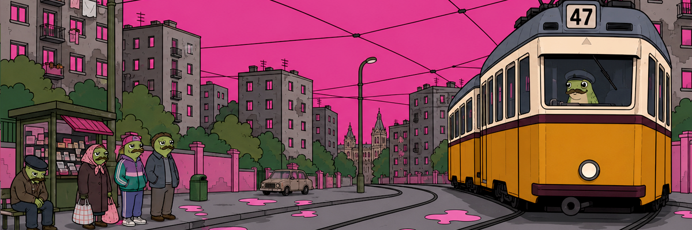
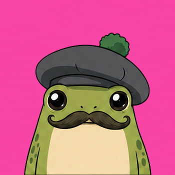
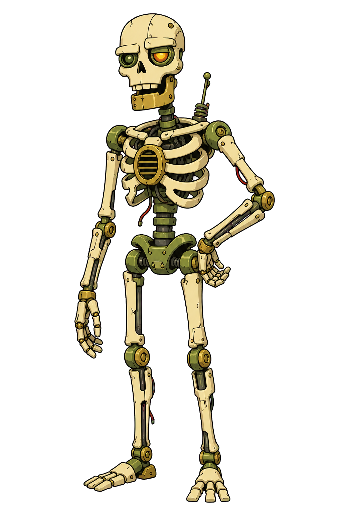

  

<h1 align="center">Streaming</h1>

  A character-driven livestream starring a sarcastic frog, his undead robot-skeleton 
  co-host, and a steadily growing collection of questionable show ideas.

  
  
  
  

This repository is the working home of the stream and its evolving collection
of shows, visuals, sounds, characters, and production tools.

It brings the creative and practical sides of the stream together in one place:
the cast and their personalities, animated character assets, episode ideas,
on-screen artwork, audio cues, and the controls used to run everything live.

## Meet the cast

<table>
  <tr>
    <td align="center" width="50%">
       
      <h3>Berry</h3>
      
A sarcastic Hungarian frog VTuber and the central host of the stream.

      
<code>frog</code> <code>host</code> <code>moustache</code>

    </td>
    <td align="center" width="50%">
       
      <h3>Miroslav</h3>
      
Berry's undead robot-skeleton co-host, argumentative equal, and closest on-stream friend.

      
<code>skeleton</code> <code>co-host</code> <code>probably innocent</code>

    </td>
  </tr>
</table>

Their project areas contain the artwork, character material, expressions,
animations, voices, histories, and reactions that bring the pair to life.

## Production

  
  
  
  

### Command Deck

Command Deck is the stream's custom control surface. It keeps the most useful
live controls and status information close at hand, including Berry's actions,
OBS scenes, Twitch, sound effects, alerts, and PNGTuber Remix.

### Visuals and audio

The repository also includes stream backgrounds, scene artwork, overlays,
profile images, automatic music, notifications, and manually triggered sound
effects. Together, these form the reusable visual and audio identity of the
show.

### Stream ideas

The `_Stream Ideas` area is a workspace for segments, formats, and supporting
materials. It holds both show-specific concepts and shared templates that can
be reused across future streams.

## Repository map

- `Berry/` - Berry's artwork, rig, animations, and character assets
- `Miroslav/` - Miroslav's character material and visual assets
- `CommandDeck/` - the custom stream control application
- `Audio/` - automatic and manually triggered stream audio
- `_Stream Ideas/` - segment concepts and reusable show materials
- Root artwork - backgrounds, scene elements, and stream branding assets

## Project status

Streaming is an active personal project that grows alongside the show. New
characters, segments, reactions, tools, and production assets are added as the
stream develops and real broadcasts reveal what would make it better.

## Privacy

Keep passwords, access tokens, and other private credentials out of version
control. Use local configuration files or environment variables for sensitive
values.
